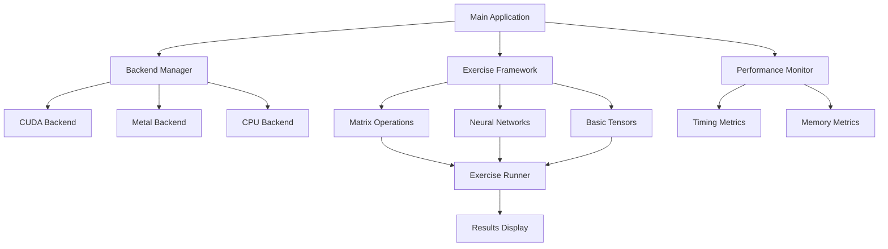

# Design Document

## Overview

The Candle Practice Enhancement transforms the existing basic Candle application into a comprehensive learning platform for tensor operations and neural network fundamentals. The design follows a modular architecture with automatic backend detection, organized exercise categories, and performance monitoring capabilities.

The system is structured around three core components: a Backend Manager for device detection and initialization, an Exercise Framework for organizing and executing learning modules, and a Performance Monitor for timing and metrics collection.

## Architecture

### High-Level Architecture



### Component Interaction Flow

1. **Initialization Phase**: Backend Manager detects and initializes the best available compute backend
2. **Menu Phase**: Exercise Framework presents categorized learning modules to the user
3. **Execution Phase**: Selected exercises run with Performance Monitor collecting metrics
4. **Results Phase**: Results and performance data are displayed with educational context

## Components and Interfaces

### Backend Manager

**Purpose**: Handles automatic detection and initialization of compute backends with graceful fallback.

**Interface**:
```rust
pub struct BackendManager {
    current_device: Device,
    backend_type: BackendType,
}

pub enum BackendType {
    Cuda,
    Metal,
    Cpu,
}

impl BackendManager {
    pub fn new() -> Result<Self>;
    pub fn get_device(&self) -> &Device;
    pub fn get_backend_info(&self) -> String;
    pub fn benchmark_backend(&self) -> Result<f64>;
}
```

**Responsibilities**:
- Detect available compute backends in priority order
- Initialize the highest priority available backend
- Provide fallback mechanism for failed initializations
- Expose current backend information for user feedback

### Exercise Framework

**Purpose**: Organizes learning exercises into categories and provides a consistent execution interface.

**Interface**:
```rust
pub trait Exercise {
    fn name(&self) -> &str;
    fn description(&self) -> &str;
    fn run(&self, device: &Device) -> Result<ExerciseResult>;
}

pub struct ExerciseCategory {
    name: String,
    exercises: Vec<Box<dyn Exercise>>,
}

pub struct ExerciseFramework {
    categories: Vec<ExerciseCategory>,
}

impl ExerciseFramework {
    pub fn new() -> Self;
    pub fn add_category(&mut self, category: ExerciseCategory);
    pub fn list_categories(&self) -> Vec<&str>;
    pub fn list_exercises(&self, category: &str) -> Vec<&str>;
    pub fn run_exercise(&self, category: &str, exercise: &str, device: &Device) -> Result<ExerciseResult>;
}
```

**Responsibilities**:
- Organize exercises into logical categories
- Provide consistent interface for exercise execution
- Handle exercise selection and navigation
- Manage exercise lifecycle and error handling

### Performance Monitor

**Purpose**: Collects timing and performance metrics for educational and comparison purposes.

**Interface**:
```rust
pub struct PerformanceMonitor {
    start_time: Option<Instant>,
    metrics: Vec<Metric>,
}

pub struct Metric {
    operation: String,
    duration: Duration,
    backend: BackendType,
    additional_info: HashMap<String, String>,
}

impl PerformanceMonitor {
    pub fn new() -> Self;
    pub fn start_timing(&mut self, operation: &str);
    pub fn end_timing(&mut self) -> Duration;
    pub fn record_metric(&mut self, metric: Metric);
    pub fn display_metrics(&self);
    pub fn compare_backends(&self, operation: &str) -> Vec<&Metric>;
}
```

**Responsibilities**:
- Time operation execution
- Collect performance metrics
- Display timing results
- Enable backend performance comparisons

## Data Models

### Exercise Categories

1. **Basic Tensors**: Fundamental tensor creation, manipulation, and data type operations
2. **Matrix Operations**: Linear algebra operations including arithmetic, transformations, and advanced operations
3. **Neural Networks**: Neural network components, layers, activation functions, and training loops

### Exercise Result Structure

```rust
pub struct ExerciseResult {
    pub success: bool,
    pub output: String,
    pub tensors: Vec<TensorInfo>,
    pub metrics: Vec<Metric>,
    pub educational_notes: Vec<String>,
}

pub struct TensorInfo {
    pub name: String,
    pub shape: Vec<usize>,
    pub dtype: String,
    pub sample_values: String,
}
```

### Configuration Model

```rust
pub struct AppConfig {
    pub preferred_backend: Option<BackendType>,
    pub display_timing: bool,
    pub verbose_output: bool,
    pub auto_benchmark: bool,
}
```

## Error Handling

### Backend Initialization Errors
- **Strategy**: Graceful fallback with user notification
- **Implementation**: Try backends in priority order, continue with next available option
- **User Experience**: Clear messaging about which backend is being used and why

### Exercise Execution Errors
- **Strategy**: Isolate errors to individual exercises without crashing the application
- **Implementation**: Wrap exercise execution in error handling that captures and displays helpful messages
- **User Experience**: Educational error messages that explain common Candle operation pitfalls

### Device Memory Errors
- **Strategy**: Detect memory limitations and suggest alternatives
- **Implementation**: Catch out-of-memory errors and provide guidance on tensor size reduction
- **User Experience**: Helpful suggestions for working within hardware constraints

## Testing Strategy

### Unit Testing
- **Backend Manager**: Test backend detection logic with mocked device availability
- **Exercise Framework**: Test exercise registration, selection, and execution flow
- **Performance Monitor**: Test timing accuracy and metric collection

### Integration Testing
- **End-to-End Flows**: Test complete user journeys from startup to exercise completion
- **Backend Switching**: Test fallback behavior when preferred backends are unavailable
- **Cross-Platform**: Validate behavior across different operating systems and hardware configurations

### Performance Testing
- **Backend Benchmarking**: Automated performance comparison across available backends
- **Memory Usage**: Monitor memory consumption patterns for different exercise types
- **Scalability**: Test with varying tensor sizes to understand performance characteristics

### Educational Validation
- **Exercise Correctness**: Verify that exercises produce expected mathematical results
- **Learning Progression**: Ensure exercises build upon each other logically
- **Error Scenarios**: Test that common mistakes produce helpful educational feedback